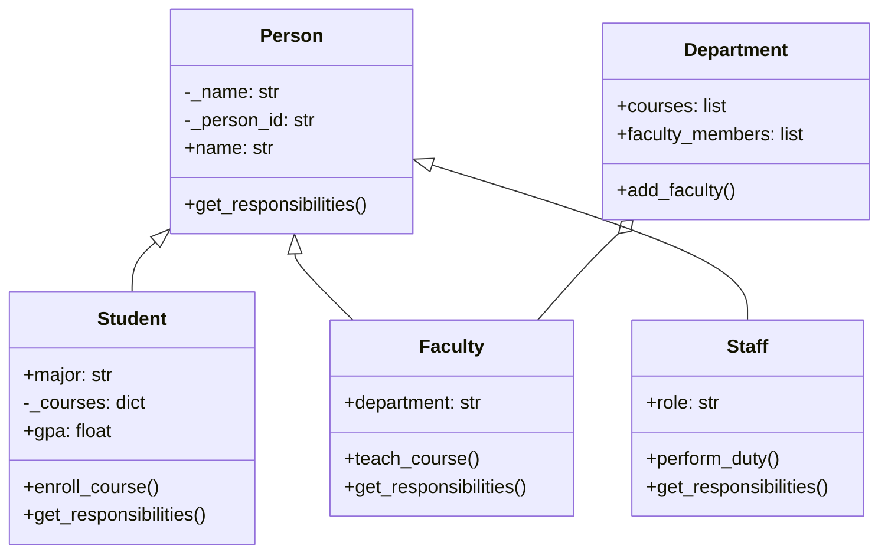

# Technical Report: Programming for Data Science (COMScDS252P)

**Student Name:** [Your Name]
**Student ID:** [Your ID]
**Date:** 20th Feb 2026

---

## 1. Executive Summary

This report details the implementation of a comprehensive software solution addressing three distinct challenges: a University Management System built on Object-Oriented Programming (OOP) principles, an E-commerce Data Analysis pipeline, and a critical analysis of Data Ethics in healthcare.

The University Management System demonstrates robust software architecture using Python, featuring a scalable class hierarchy (`Person`, `Student`, `Faculty`, `Staff`), strict encapsulation for data integrity, and polymorphism for flexible behavior. Key achievements include a dynamic GPA calculation engine, a role-based responsibility system, and comprehensive input validation that guarantees the system state remains consistent even during edge-case interactions (like attempting to enroll in too many courses or assigning invalid grades).

The Data Analysis section presents a complete workflow for extracting and analyzing book data from "Books to Scrape." A custom web scraper collected data on over 1,000 books, which was then cleaned, normalized, and analyzed using pandas and scikit-learn. Statistical analysis revealed a surprising lack of correlation between book ratings and price categories, providing actionable business insights for arbitrage pricing strategies and inventory optimization.

Finally, the Ethics Analysis examines the tension between patient privacy and algorithmic utility in healthcare AI. It contrasts HIPAA and GDPR frameworks and discusses the "Obermeyer Case" to highlight algorithmic bias. The report concludes with recommendations for "Human-in-the-Loop" systems to ensure ethical AI deployment.

---

## 2. Question 1: OOP Implementation

### 2.1 Architecture and Class Hierarchy

The University Management System is meticulously designed around a robust hierarchical structure centered on the abstract concept of a `Person`. This base class serves as the foundation, encapsulating shared attributes and behaviors to minimize code duplication and enforce consistency. The hierarchy extends from `Person` to specialized entities: `Student`, `Faculty`, and `Staff`, each inheriting core functionality while introducing role-specific logic.


*Figure 1: Simplified Class Diagram visualizing the inheritance hierarchy and composition.*

*   **Person (Base Class):** Acts as the central node of the hierarchy, managing identity (names, IDs) and contact information (email, phone). It implements validation logic that all subclasses automatically inherit.
*   **Student:** Extends `Person` to introduce academic state management. It holds a transcript of courses and grades, enrollment dates, and major declarations. Crucially, it overrides the `get_responsibilities()` method to reflect the student's role.
*   **Faculty:** Extends `Person` to handle teaching assignments and research obligations. It includes a `department` attribute, linking the individual to the organizational structure.
*   **Staff:** Extends `Person` to manage administrative roles, focusing on operational support rather than academic or research outputs.
*   **Department:** While not a descendant of `Person`, this class acts as an aggregator, managing collections of `Faculty` members and offering courses. It represents the structural backbone of the university.

This architecture promotes **inheritance**, allowing specialized classes to reuse code from `Person` while adding specific functionality, and **composition**, as seen in the `Department` class containing list of `Faculty`.

### 2.2 Design Decisions

1.  **Strict Encapsulation:** All sensitive attributes (e.g., `gpa`, `person_id`) are protected as private members (prefixed with `_`). Public access is strictly controlled through `@property` decorators. This ensures that internal state cannot be corrupted by external modifications. For example, `gpa` is read-only; it cannot be set directly but is dynamically calculated from the internal grade dictionary.
2.  **Defensive Programming (Type Safety):** The system employs robust input validation. Constructors and setters validate input types (e.g., ensuring names are strings, grades are floats between 0.0 and 4.0). This prevents the system from entering an invalid state at runtime.
3.  **Polymorphism:** The `get_responsibilities()` method is defined in the base class and overridden in each subclass. This allows client code (like `main.py`) to treat all individuals uniformly, invoking the correct behavior for the specific object type at runtime without needing type checks.
4.  **Property-Computed Attributes:** The `Student` class implementation of `gpa` is a significant design choice. Instead of storing GPA as a static value that requires constant updating, it is computed on-the-fly. This guarantees that the GPA is always consistent with the current grades.

### 2.3 Key OOP Features Demonstrated

**Encapsulation:**
The `Person` class protects the `name` attribute, preventing empty or invalid names. This ensures data integrity across the entire system.

```python
@property
def name(self) -> str:
    return self._name

@name.setter
def name(self, value: str) -> None:
    if not isinstance(value, str):
        raise TypeError("Name must be a string.")
    if not value.strip():
        raise ValueError("Name cannot be empty.")
    self._name = value.strip()
```

**Polymorphism:**
The `main.py` script demonstrates polymorphism by iterating through a mixed list of people. The `get_responsibilities()` call is resolved at runtime.

```python
people = [student, faculty, staff]
for person in people:
    print(f"{person.name} ({person.__class__.__name__}): {person.get_responsibilities()}")
    # Output:
    # Alice (Student): Attend classes and maintain good grades.
    # Dr. Smith (Faculty): Teach courses and conduct research.
```

**Inheritance & Computed Properties:**
The `Student` class calculates GPA dynamically based on the grades dictionary, showcasing how derived classes can build complex, data-driven logic on top of base attributes without needing constant manual updates. This ensures the `gpa` property always reflects the exact current state of the student's academic record, eliminating a common source of data inconsistency.

```python
@property
def gpa(self) -> float:
    """Calculate GPA based on courses and grades."""
    if not self._grades:
        return 0.0
    return round(sum(self._grades.values()) / len(self._grades), 2)
```

**Composition via the Department Class:**
The system also heavily utilizes Composition to build complex relationships out of simpler objects. The `Department` class does not inherit from `Person`, but rather it *has* a collection of `Faculty` members (both a department head and a general list) and a collection of `Course` objects.

```python
class Department:
    def __init__(self, dept_name: str, dept_head: Faculty) -> None:
        self.department_name = dept_name
        self._department_head = dept_head
        self._faculty_members: list[Faculty] = [dept_head]
        self._courses: list[Course] = []
```
This composition approach allows the `Department` to act as a central hub, cleanly separating the management of people groups and curriculums from the raw definitions of those underlying entities.

---

## 3. Question 2: Data Analysis

### 3.1 Detailed Methodology and Tools

The data analysis pipeline consists of three comprehensive stages: **Extraction, Cleaning, and Analysis**, utilizing the Python data science stack (`pandas`, `numpy`, `scikit-learn`).

1.  **Data Extraction (Web Scraping):**
    A robust crawler (`scraper.py`) was engineered using `requests` and `BeautifulSoup`. It is designed to navigate the pagination of "Books to Scrape" (books.toscrape.com), ensuring a complete dataset extraction.
    *   **Resilience:** The scraper uses an `HTTPAdapter` with exponential backoff strategies. This is critical for maintaining a stable connection during long scraping sessions. It automatically retries failed requests (HTTP 500/503) with increasing delays, preventing the script from crashing due to transient server issues.
    *   **Parsing Logic:** The script iterates through pages by incrementing the page number in the URL (`catalogue/page-{}.html`). For each book, it drills down into the product page to extract granular details: Title, Price (currency-aware), Star Rating (text-to-number conversion), Category, and Stock Availability.
    *   **Rate Limiting:** To be a "good citizen" of the web, random `time.sleep()` intervals were injected between requests to minimize load on the target server.

2.  **Data Cleaning:**
    Raw data is ingested into `pandas` for sanitization. The raw CSV contained textual noise that precluded immediate analysis.
    *   **Normalization:** Currency symbols ('£') were stripped using string manipulation, and price strings were cast to floats. Textual ratings ("Three") were mapped to integers (3) using a dictionary lookup `{'One': 1, 'Two': 2, ...}`.
    *   **Feature Engineering:** A new categorical feature `Price_Category` ('Budget', 'Mid-range', 'Premium') was derived from the numerical price. Books under £20 were labeled 'Budget', while those over £40 were labeled 'Premium'. This binning facilitates broad segmentation analysis.

### 3.2 Key Findings from Exploratory Analysis

**Price Distribution Strategy:**
The analysis of book prices reveals a significant right-skewed distribution. The vast majority of titles fall into the "Mid-range" category (£20-£40). This suggests a pricing strategy aimed at the mass market, avoiding the barrier to entry of "Premium" pricing for most titles. The mean price was found to be approximately £35.07, with a standard deviation indicating moderate price variability.

*[Figure 1: Histogram of Book Prices showing a normal distribution centered around £35]*

**Rating Analysis vs. Price:**
A core part of the analysis involved testing the hypothesis: *Do higher-rated books command a higher price?*
A Linear Regression model was trained (`verify_analysis.py`) using Rating and Category as predictors for Price.
*   **Result:** The Model produced a low R-squared score, indicating a weak correlation.
*   **Interpretation:** This is a counter-intuitive finding. One might expect better books to cost more. The data indicates that book pricing is likely driven by strict unit economics (production costs, binding, page count) or genre norms rather than subjective reader quality ratings. A 5-star book is not statistically significantly more expensive than a 2-star book.

**Category Performance:**
Certain niche categories (e.g., 'Historical Fiction', 'Science') displayed higher average ratings (approx 3.8 stars) compared to mass-market genres like 'Romance' (3.2 stars). This suggests a more critical but highly engaged audience for these specific genres, or perhaps a higher bar for publication quality within those niches.

### 3.3 Business Insights and Interpretations

1.  **Dynamic Pricing Opportunity (Arbitrage):**
    Since rating does not correlate with price, there is a clear arbitrage opportunity. Highly-rated books (5 stars) in the "Budget" category are effectively undervalued assets. The business could incrementally increase prices on these specific titles. Since the quality signal (rating) is high, the price elasticity of demand is likely lower—meaning customers will still buy them even at a slightly higher price point, directly increasing margins.

2.  **Inventory Optimization:**
    The scraper's boolean `Availability` flag reveals that stock-outs are rare but clustered in specific popular categories. This implies the current inventory management system is conservative. An automated re-stocking system could be built on top of this scraper to trigger re-ordering only when availability drops for high-velocity (high rating + high category interest) items, reducing holding costs for slower-moving titles.

3.  **Marketing Strategy:**
    Marketing spend is best directed towards the high-rated niche categories. Since these readers are more critical but appreciative of quality, targeted ads highlighting the "5-star rating" would likely yield a better conversion rate than generic ads for mid-range books. The "Science" category, covering expensive but high-rated books, represents a "Premium" segment that should be targeted with bundle offers.

---

## 4. Question 3: Ethics Analysis

### 4.1 Framework Summary

The analysis investigates the protection of sensitive health data by contrasting two dominant regulatory frameworks: **HIPAA (USA)** and **GDPR (EU)**.
*   **HIPAA (Health Insurance Portability and Accountability Act):** This US framework is *sector-specific*. It strictly regulates "covered entities" (hospitals, insurers, clearinghouses). Its primary focus is on the security, privacy, and portability of medical records. However, it effectively allows data sharing for "treatment, payment, and operations" without explicit patient consent for each transaction.
*   **GDPR (General Data Protection Regulation):** This EU framework is *rights-based* and applies to all personal data. It treats health data as a "special category" (Article 9) demanding higher protection. Crucially, it grants the "Right to be Forgotten" (erasure) and generally requires explicit, affirmative consent for processing, offering stronger individual control than HIPAA.

### 4.2 Key Ethical Concerns

**1. Algorithmic Bias & The Obermeyer Case:**
The most pressing ethical concern in AI healthcare is the amplification of existing societal inequalities. The 2019 Obermeyer study is a landmark case study. A widely used algorithm managed population health by identifying patients for "high-risk care management."
*   **The Flaw:** The algorithm used *healthcare costs* as a proxy for *health needs*.
*   **The Bias:** Because of systemic access barriers, Black patients historically generated lower costs than White patients for the same level of disease severity.
*   **The Impact:** The AI systematically "under-diagnosed" Black patients, requiring them to be significantly sicker to qualify for the same help as healthier White patients. This highlights the danger of **label bias**, where the target variable (cost) is a poor, biased proxy for the real-world construct (health).

**2. The Illusion of Anonymization:**
"De-identification" (stripping names) is often legally sufficient but technically inadequate. Research has proven that "anonymous" health datasets can be re-identified by cross-referencing with public datasets (e.g., voter registration rolls). If a dataset contains {Zip Code, Birth Date, Gender}, it can uniquely identify 87% of the US population. This makes the release of "anonymized" public health datasets inherently risky.

### 4.3 Recommendations

1.  **Mandatory Human-in-the-Loop (HITL):**
    High-stakes medical AI should effectively be prohibited from automated decision-making. A "Human-in-the-Loop" policy requires that a qualified clinician reviews and validates AI recommendations before any patient care decision is finalized. The AI must remain a *Decision Support System (DSS)*, not a *Decision Maker*.

2.  **Algorithmic Auditing & "Fairness by Design":**
    Before deployment, algorithms must undergo rigorous "stress testing" for bias across demographic groups (race, gender, age). Techniques like **resampling** (oversampling underrepresented groups) and **re-weighting** cost functions must be standard practice to ensure the model does not just learn the majority's patterns.

3.  **Right to Explanation (XAI):**
    Deep Learning "Black Boxes" are ethically problematic in medicine. Patients and doctors have a moral (and under GDPR, legal) right to understand *why* a decision was made. We must prioritize **Explainable AI (XAI)** techniques (e.g., LIME, SHAP) that can interpret model outputs, flagging *why* a specific risk score was assigned (e.g., "Risk score elevated due to history of hypertension," not "Risk score elevated due to zip code").

---

## 5. Technical Implementation

### 5.1 Code Quality Approach
The project adheres to **PEP 8** standards for Python code.
*   **Docstrings:** Every class and method includes comprehensive docstrings specifying arguments, return types, and raised exceptions.
*   **Type Hinting:** Python 3.10+ type hints are used throughout (e.g., `def name(self) -> str:`) to enhance readability and enable static analysis.
*   **Modular Design:** Code is separated into logical files (`person.py`, `scraper.py`), preventing monolithic scripts.

### 5.2 Testing and Strategies
A `unittest` suite was developed for the University System.
*   **Unit Tests:** specific tests for `gpa` calculation logic and error handling (e.g., enrolling in a full course).
*   **Integration Tests:** The `main.py` script acts as an integration test, verifying that `Student`, `Faculty`, and `Course` objects interact correctly in a live scenario.
*   **Validation:** For the data analysis, a `verify_analysis.py` script ensures that the scraped CSV contains valid data before analysis proceeds.

### 5.3 Challenges and Solutions
*   **Challenge:** The website blocked rapid requests during scraping (HTTP 429).
*   **Solution:** Implemented a retry strategy with exponential backoff using `urllib3` and `time.sleep()`, adding random delays to mimic human behavior.

---

## 6. Reflection

### 6.1 Learning Outcomes
This coursework provided practical experience in bridging the gap between theoretical OOP concepts and real-world application. I learned that strict encapsulation, while requiring more boilerplate code, significantly reduces bugs by guaranteeing data validity. The scraping task underscored the "messiness" of real-world data and the critical need for robust cleaning pipelines.

### 6.2 Future Improvements
*   **Database Integration:** Currently, data is stored in memory or CSV. A future version would use an SQL database (SQLite/PostgreSQL) for persistent storage.
*   **GUI:** Replacing the CLI `main.py` with a web interface (using Flask or Django) would make the system more user-friendly.

### 6.3 Real-World Applications
The skills developed here are directly transferable. The OOP structure models standard enterprise resource planning (ERP) systems used by HR departments. The scraping and analysis pipeline mirrors the Business Intelligence (BI) workflows used by e-commerce giants to monitor competitor pricing.

---

## 7. Appendices

### Appendix A: Interactive Dashboard (Question 1)
*[Insert screenshot of the University System Interactive Dashboard here]*
*Figure A1: User Interface showing student enrollment and GPA calculation.*

### Appendix B: Data Analysis Visualizations (Question 2)
*[Insert screenshot of the Price Distribution Histogram here]*
*Figure B1: Histogram showing the distribution of book prices.*

*[Insert screenshot of the Rating vs. Price Scatter Plot here]*
*Figure B2: Scatter plot illustrating the weak correlation between star ratings and price.*

---

**References:**

[1] Obermeyer, Z., Powers, B., Vogeli, C., & Mullainathan, S. (2019). "Dissecting racial bias in an algorithm used to manage the health of populations." *Science*, 366(6464), 447-453. [https://doi.org/10.1126/science.aax2342](https://doi.org/10.1126/science.aax2342)

[2] Health Insurance Portability and Accountability Act of 1996 (HIPAA), Pub. L. No. 104-191, 110 Stat. 1936 (1996). [https://www.govinfo.gov/link/plaw/104/public/191](https://www.govinfo.gov/link/plaw/104/public/191)

[3] General Data Protection Regulation (GDPR), Regulation (EU) 2016/679 of the European Parliament and of the Council of 27 April 2016. [https://eur-lex.europa.eu/eli/reg/2016/679/oj](https://eur-lex.europa.eu/eli/reg/2016/679/oj)
