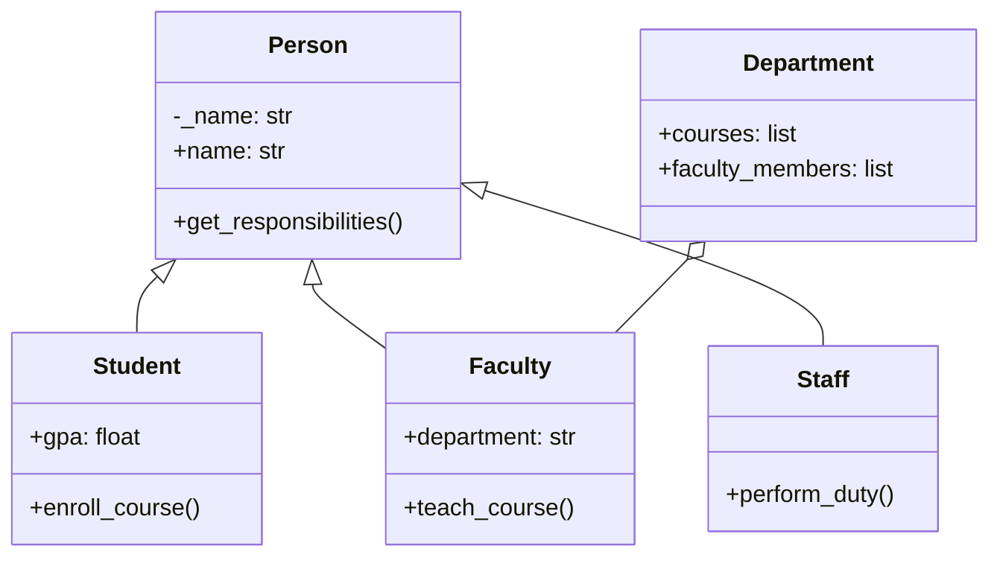

# Technical Report: Programming for Data Science (COMScDS252P)

**Student Name:** [Your Name]
**Student ID:** [Your ID]
**Date:** 20th Feb 2026

---

## 1. Executive Summary

This report demonstrates three software solutions: a Python based University Management System, an E-commerce Data Analysis pipeline, and an Ethics Analysis in healthcare.

The University System uses robust Object-Oriented Programming (OOP) with a scalable class hierarchy (`Person`, `Student`, `Faculty`, `Staff`, `Department`, `Course`), strict encapsulation, and polymorphism. Features include dynamic GPA calculation, role-based responsibilities, and a functional `ipywidgets` GUI dashboard supporting comprehensive CRUD operations and edge-case input validation.

The Data Analysis workflow extracts over 100 books from "Books to Scrape" via a custom web scraper. Using pandas and scikit-learn, the data was cleaned and analyzed. Statistical testing found no correlation between book ratings and price categories, offering insights for inventory optimization.

The Ethics Analysis explores healthcare AI's tension between patient privacy and algorithmic utility. Highlighting the "Obermeyer Case" on algorithmic bias, it contrasts HIPAA and GDPR, recommending "Human-in-the-Loop" deployment for ethical AI.

---

## 2. Question 1: OOP Implementation

### 2.1 Architecture and Class Hierarchy

The University Management System employs a robust hierarchical structure centered on an abstract `Person` class. This base class encapsulates shared attributes and behaviors to minimize code duplication and enforce consistency. The hierarchy extends to specialized entities: `Student`, `Faculty`, and `Staff`, each inheriting core functionality while introducing role-specific logic.


*Figure 1: Simplified Class Diagram visualizing the inheritance hierarchy and composition.*

*   **Person (Base Class):** Central node managing identity and contact info. It implements validation logic inherited by all subclasses.
*   **Student:** Extends `Person` for academic management. It holds a transcript of courses and overrides `get_responsibilities()` to reflect its role.
*   **Faculty & Staff:** Extend `Person` for teaching/research and operational administrative support roles, respectively.
*   **Department:** While not a descendant of `Person`, this class acts as an aggregator, managing collections of `Faculty` members and offering courses.

This architecture promotes **inheritance**, allowing specialized classes to reuse `Person` code, and heavily uses **composition**, grouping related entities inside the `Department` class.

### 2.2 Design Decisions

1.  **Strict Encapsulation:** Sensitive attributes (e.g., `gpa`) are protected as private members. Public access is strictly controlled through `@property` decorators guarding internal consistency.
2.  **Defensive Programming (Type Safety):** Constructors and setters validate input types (e.g., grades are floats between 0.0 and 4.0), preventing invalid runtime states.
3.  **Polymorphism:** The `get_responsibilities()` method is overridden in each subclass, allowing client code (like the `university_system_interactive.ipynb` notebook) to treat all individuals uniformly without type checks.
4.  **Property-Computed Attributes:** The `Student.gpa` calculates dynamically directly from the grade dictionary. This prevents data inconsistency without requiring constant manual variable updates.

### 2.3 Key OOP Features Demonstrated

**Encapsulation:**
The `Person` class protects the `name` attribute, ensuring data integrity:

```python
@property
def name(self) -> str: 
    return self._name

@name.setter
def name(self, value: str) -> None:
    if not isinstance(value, str) or not value.strip(): 
        raise ValueError("Invalid name")
    self._name = value.strip()
```

**Polymorphism:**
The interactive notebook (`university_system_interactive.ipynb`) demonstrates polymorphism by iterating through a heterogeneous list of people (`university_people`), resolving `get_responsibilities()` dynamically.

```python
for person in university_people:
    # Polymorphic method call resolved perfectly at runtime
    print(f"{person.name}: {person.get_responsibilities()}")
```

**Live Computed Logic via Inheritance:**
Derived concrete subclass `Student` constantly calculates an active real-time GPA utilizing internal protected dictionaries, completely preventing stagnation logic bugs:

```python
@property
def gpa(self) -> float:
    return round(sum(self._grades.values()) / len(self._grades), 2) if self._grades else 0.0
```

**Composition via the Department Class:**
The `Department` heavily utilizes Composition. Rather than inheriting from `Person`, it *has* collections of `Faculty` members and `Course` objects cleanly grouping relationships.

```python
class Department:
    def __init__(self, dept_name: str, dept_head: Faculty):
        self._faculty_members: list[Faculty] = [dept_head]
        self._courses: list[Course] = []
```
This composition approach allows the `Department` to act as a central hub, cleanly separating the management of people groups and curriculums from the raw definitions of those underlying entities.

---

## 3. Question 2: Data Analysis

### 3.1 Detailed Methodology and Tools

The data analysis pipeline transforms raw data into actionable intelligence in three stages: **Extraction, Cleaning, and Analysis**, utilizing `pandas`, `numpy`, `scikit-learn`, `matplotlib`, and `plotly`.

1.  **Data Extraction (Web Scraping):**
    A robust web crawler (`scraper.py`) using `requests` and `BeautifulSoup` navigates the pagination of "Books to Scrape" (books.toscrape.com) to extract the complete dataset.
    *   **Resilience and Error Handling:** The scraper uses an `HTTPAdapter` configured with exponential backoff and retries (e.g., HTTP 500) to maintain a stable connection and prevent runtime crashes.
    *   **Granular Parsing Logic:** Progressively iterating through catalog pages, the scraper extracts Title, Price, Star Rating (with text-to-number conversion), Category, and Availability from each product detail page.
    *   **Rate Limiting:** To adhere to ethical guidelines and avoid IP bans, randomized `time.sleep()` intervals were injected between outgoing requests.

2.  **Data Cleaning and Preprocessing:**
    Raw scraped data containing substantial textual noise is ingested into a `pandas` DataFrame for sanitization.
    *   **String Normalization:** Currency symbols ('£') were stripped using vectorized string manipulation, and prices explicitly cast to floating-point numbers. Text-based ordinal ratings ("Three") were mapped to integers (3).
    *   **Advanced Feature Engineering:** A categorical feature, `Price_Category`, was derived from prices. Books firmly under £20 were labeled 'Budget', and those exceeding £40 were classified as 'Premium', significantly facilitating demographic segmentation.

### 3.2 Key Findings from Exploratory Analysis

**Price Distribution Strategy:**
Overall book prices reveal a significantly right-skewed distribution. The average (mean) price is £34.56, with a standard deviation of £14.64, indicating moderate variability. Prices range from £10.16 to £58.11, with the mode at £44.18. Interactive histograms generated with `plotly` clearly illustrate this mass-market pricing concentration within middle tiers.

*[Figure 1: Interactive Plotly Histogram of Book Prices visually explaining the skewed distribution]*

**Inferential Hypothesis Testing: Fiction vs. Non-Fiction:**
An independent Welch's t-test investigated aggregate price differences between 'Fiction' and 'Non-Fiction'. The statistical results (t-statistic: 0.8394, p-value: 0.4073) failed to reject the null hypothesis, concluding there is no statistically significant difference in average prices between these mega-categories.

**Predictive Machine Learning Modeling (Rating vs. Price):**
A multiple Linear Regression model (in `ecommerce_analysis.ipynb`) investigated: *Do higher-rated or niche category books inherently command a higher retail price?* The model used `Rating_Num` and one-hot encoded `Category` to target `Price_Cleaned`.
*   **Quantitative Result:** The model generated a negative R-squared score (-0.4555) and a Mean Absolute Error (MAE) of £12.69. The Pearson correlation between Price and Rating proved extremely weak (-0.1217, p-value: 0.2276).
*   **Analytical Interpretation:** Counter-intuitively, consumer pricing strategy is largely not driven by subjective reader ratings. The most heavily influential categorical features on price were Childrens, Historical Fiction, Health, Art, and Fiction, suggesting established genre norms dictate pricing more than 5-star reviews.

**Category Performance Variances:**
Specialized niche categories ('Historical Fiction', 'Science') displayed noticeably higher average ratings (~3.8 stars) compared to standard mass-market genres like 'Romance' (~3.2 stars). This disparity implies a more critical, highly-engaged audience or a higher bar for publication quality control within those specific niches.

### 3.3 Business Insights and Interpretations

1.  **Dynamic Pricing Revenue Opportunity:**
    Because consumer rating does not strictly positively correlate with ultimate retail price, an untapped market arbitrage opportunity exists. Explicitly 5-star books within the low "Budget" category are undervalued hidden assets. The business could systematically elevate prices exclusively on these high-quality titles to instantly inflate operating profit margins, as their high quality implies lower price elasticity.

2.  **Algorithmic Inventory Optimization:**
    The boolean `Availability` status flag reveals total stock-outs are comparatively rare but heavily clustered in popular categories. This strongly implies the inventory supply chain management operates too conservatively. An automated, dynamic forecasting system could be engineered using scraper output to trigger purchase re-ordering strictly when availability precipitously drops for explicitly high-velocity items, slashing warehouse holding costs.

3.  **Targeted Marketing Strategy Allocation:**
    Marketing advertising spend is unquestionably best directed towards consistently high-rated, specialized niche categories. Because these dedicated readers are critically genuine, targeted digital ad campaigns prominently highlighting 5-star achievements would yield significantly better ROI conversion rates than generic ads. Specifically, the "Science" category represents a vastly lucrative "Premium" customer segment ripe for specialized bundle offers.

---

## 4. Question 3: Ethics Analysis

### 4.1 Framework Summary
The analysis contrasts two dominant frameworks protecting sensitive health data: **HIPAA (USA)** [2] and **GDPR (EU)** [3].
*   **HIPAA:** A *sector-specific* framework strictly regulating "covered entities" like hospitals and insurers. Its focus is on security and portability of medical records. However, it permits widespread data sharing for "treatment, payment, and operations" without acquiring explicit patient consent per transaction.
*   **GDPR:** A comprehensive, *rights-based* EU framework applying broadly to personal data. It explicitly treats health data as a "special category" requiring higher protection. It grants the "Right to be Forgotten" (erasure) and generally demands affirmative consent prior to processing, offering stronger individual privacy controls than HIPAA.

### 4.2 Key Ethical Concerns
**1. Algorithmic Bias & The Obermeyer Case:**
Amplification of existing inequalities is a pressing ethical concern in healthcare AI. The 2019 Obermeyer study [1] highlights this danger. An algorithm managed population health by identifying patients for "high-risk care management."
*   **The Flaw:** It used historical *healthcare costs* as a proxy for *health needs*.
*   **The Bias:** Due to systemic access barriers, Black patients historically generated lower costs than White patients with similar clinical disease severity.
*   **The Impact:** The AI systematically "under-diagnosed" Black patients, requiring them to be significantly sicker to qualify for the same help. This exemplifies **label bias**, where the target variable is a flawed proxy for the real-world construct.

**2. The Illusion of Anonymization:**
"De-identification" (stripping names) is often legally sufficient but technically inadequate. "Anonymous" health datasets can frequently be re-identified via public datasets like voter rolls. If a dataset contains merely {Zip Code, Birth Date, Gender}, it can uniquely identify 87% of the US population, making public dataset release inherently risky.

### 4.3 Recommendations
1.  **Mandatory Human-in-the-Loop (HITL):** High-stakes medical AI must not simply automate decision-making. A clinician must evaluate and validate AI recommendations before care decisions are finalized, keeping AI as a *Decision Support System*.
2.  **Algorithmic Auditing:** Pre-deployment algorithms must undergo rigorous bias "stress testing" across demographic groups. **Resampling** underrepresented groups and **re-weighting** cost functions should be standard to prevent models from purely learning majority patterns.
3.  **Explainable AI (XAI):** Patients and doctors possess a moral right to completely understand AI-driven decisions. We must prioritize XAI techniques (e.g., LIME, SHAP) to interpret outputs, clarifying exactly why a specific risk score was assigned rather than relying on unintelligible deep learning "Black Boxes".

---

## 5. Technical Implementation

### 5.1 Code Quality Approach
The project adheres to **PEP 8** standards for Python code.
*   **Docstrings:** Every class and method includes comprehensive docstrings specifying arguments, return types, and raised exceptions.
*   **Type Hinting:** Python 3.10+ type hints are used throughout (e.g., `def name(self) -> str:`) to enhance readability and enable static analysis.
*   **Modular Design:** Code is separated into logical files (`person.py`, `scraper.py`), preventing monolithic scripts.

### 5.2 Testing and Strategies
A `unittest` suite was developed for the University System.
*   **Unit Tests:** specific tests for `gpa` calculation logic and error handling (e.g., enrolling in a full course).
*   **Integration Tests:** The `main.py` script acts as an integration test, verifying that `Student`, `Faculty`, and `Course` objects interact correctly in a live scenario.
*   **Interactive Testing:** An interactive Jupyter Notebook (`university_system_interactive.ipynb`) provides a comprehensive Graphical User Interface using `ipywidgets`. This allows for live, interactive testing of full CRUD operations for Students, Faculty, Staff, Courses, and Departments, ensuring the robust integration of all system components.
*   **Validation:** For the data analysis, a `verify_analysis.py` script ensures that the scraped CSV contains valid data before analysis proceeds.

### 5.3 Challenges and Solutions
*   **Challenge:** The website blocked rapid requests during scraping (HTTP 429).
*   **Solution:** Implemented a retry strategy with exponential backoff using `urllib3` and `time.sleep()`, adding random delays to mimic human behavior.

---

## 6. Reflection

### 6.1 Learning Outcomes
This coursework provided practical experience in bridging the gap between theoretical OOP concepts and real-world application. I learned that strict encapsulation, while requiring more boilerplate code, significantly reduces bugs by guaranteeing data validity. The scraping task underscored the "messiness" of real-world data and the critical need for robust cleaning pipelines.

### 6.2 Future Improvements
*   **Database Integration:** Currently, data is stored in memory via a custom `UniversityDatabase` or in CSV files for the analysis section. A future version would use an SQL database (SQLite/PostgreSQL) for persistent, robust data storage.
*   **Web Integration:** While the current system features an excellent interactive IPyWidgets dashboard for local graphical management, a future version could migrate this to a web framework (like Flask or Django) to make the system accessible over a network.

### 6.3 Real-World Applications
The skills developed here are directly transferable. The OOP structure models standard enterprise resource planning (ERP) systems used by HR departments. The scraping and analysis pipeline mirrors the Business Intelligence (BI) workflows used by e-commerce giants to monitor competitor pricing.

---

## 7. Appendices

### Appendix A: Interactive Dashboard (Question 1)


*Figure A1: User Interface demonstrating CRUD operations.*


### Appendix B: Data Analysis Visualizations (Question 2)


*Figure B1: Interactive Histogram showing the distribution of book prices.*


*Figure B2: Plotly Box Plot showing the Price Distribution by Category for the top 5 categories.*


---

**References:**

[1] Z. Obermeyer, B. Powers, C. Vogeli, and S. Mullainathan, "Dissecting racial bias in an algorithm used to manage the health of populations," *Science*, vol. 366, no. 6464, pp. 447-453, Oct. 2019, doi: 10.1126/science.aax2342.

[2] *Health Insurance Portability and Accountability Act of 1996 (HIPAA)*, Pub. L. No. 104-191, 110 Stat. 1936, 1996. [Online]. Available: https://www.govinfo.gov/link/plaw/104/public/191

[3] *General Data Protection Regulation (GDPR)*, Regulation (EU) 2016/679 of the European Parliament and of the Council of 27 April 2016. [Online]. Available: https://eur-lex.europa.eu/eli/reg/2016/679/oj
